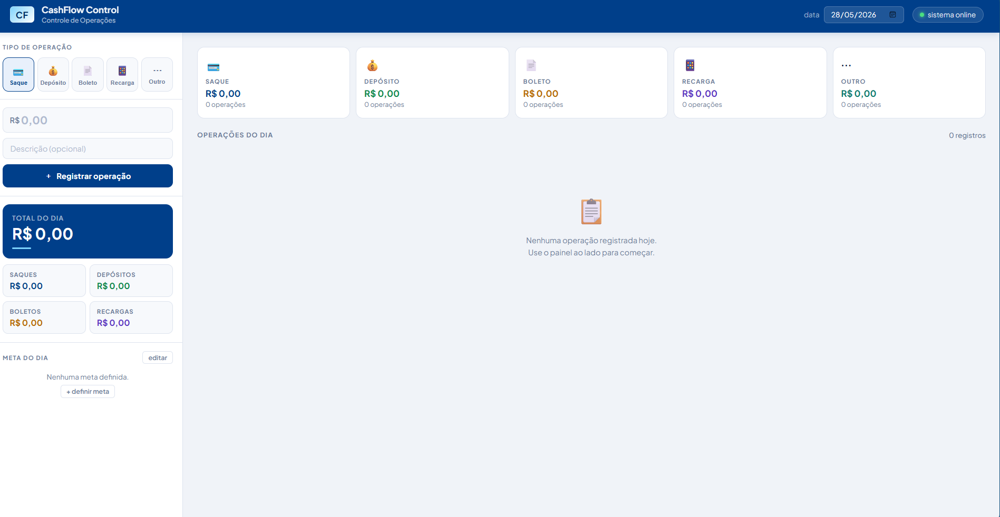
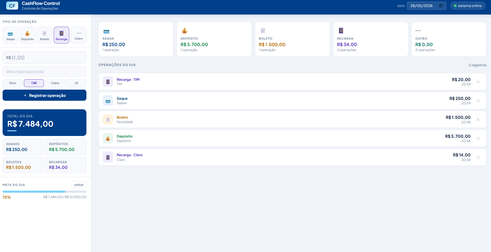

# CashFlow Control

Sistema web de controle de operacoes de caixa. O projeto ajuda operadores a registrar movimentacoes do dia, acompanhar totais, definir metas e consultar historico sem depender de planilhas ou conferencia manual.

---

## Screenshots

> **Painel vazio - inicio do dia**
> 
> **Painel com operacoes registradas**
> 

---

## Funcionalidades

- Registro de operacoes em tempo real: **saque, deposito, boleto, recarga e outros**
- Selecao de operadora para recargas (Vivo, TIM, Claro, Oi)
- **Dashboard com totais do dia** agrupados por tipo de operacao
- **Meta diaria** com barra de progresso
- **Monitor de sistema** com verificacao periodica de conectividade
- Navegacao por datas anteriores para consulta de historico
- Dados persistidos localmente em JSON, sem necessidade de banco de dados externo

---

## Tecnologias

| Camada | Tecnologia |
|---|---|
| Backend | Node.js + Express |
| Frontend | HTML, CSS e JavaScript puro |
| Persistencia | JSON local (arquivo `data/operacoes.json`) |
| Fontes | Google Fonts - Plus Jakarta Sans |

---

## Como rodar localmente

**Pre-requisito:** ter o [Node.js](https://nodejs.org) instalado.

```bash
# 1. Clone o repositorio
git clone https://github.com/seu-usuario/cashflow-control.git
cd cashflow-control

# 2. Instale as dependencias
npm install

# 3. Inicie o servidor
npm start

# 4. Acesse no navegador
http://localhost:3000
```

Para desenvolvimento com reload automatico:

```bash
npm run dev
```

---

## Estrutura do projeto

```text
cashflow-control/
|-- server.js           # API REST com Express (backend)
|-- public/
|   `-- index.html      # Interface completa (frontend)
|-- data/
|   `-- operacoes.json  # Dados gerados automaticamente
`-- package.json
```

---

## API

| Metodo | Rota | Descricao |
|---|---|---|
| GET | `/api/operacoes?data=YYYY-MM-DD` | Lista operacoes de um dia |
| POST | `/api/operacoes` | Registra nova operacao |
| DELETE | `/api/operacoes/:id` | Remove uma operacao |
| GET | `/api/resumo?data=YYYY-MM-DD` | Totais agrupados por tipo |
| GET | `/api/meta` | Retorna a meta diaria |
| POST | `/api/meta` | Define a meta diaria |
| GET | `/api/status-sistema` | Verifica conectividade do sistema |
| GET | `/api/datas` | Lista datas com registros |

---

## Contexto

Projeto desenvolvido para automatizar processos internos de controle de caixa e ganhar visibilidade sobre a movimentacao diaria. A escolha por uma stack simples (Node + JS puro) foi intencional, priorizando entrega, manutencao e facilidade de evolucao.

---

## Proximas melhorias

- [ ] Exportar fechamento de caixa em PDF
- [ ] Notificacao quando o sistema cair
- [ ] Grafico de evolucao semanal
- [ ] Autenticacao por senha

---

## Autor

Feito por **David**.
